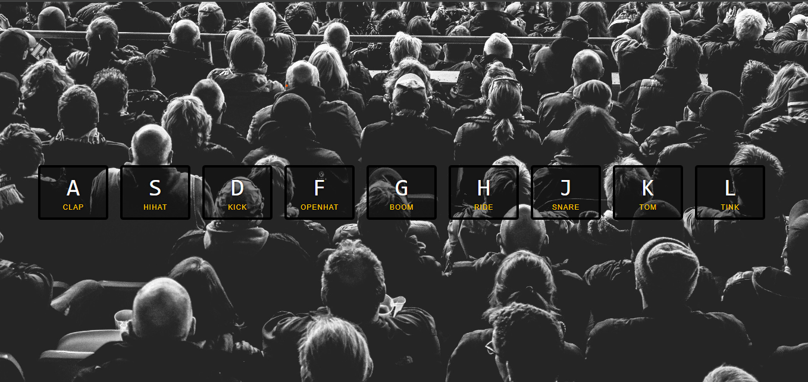

# 🥁 JavaScript Drum Kit

A fun **drum kit** built using **JavaScript, HTML, and CSS**.  
This project is part of the [JavaScript30 Challenge](https://javascript30.com/) by Wes Bos, where you learn to manipulate the DOM, handle events, and work with audio.

---

## 🎬 Demo

  
Try pressing the keys **A, S, D, F, G, H, J, K, L** on your keyboard to play different drum sounds!

**Live Demo:** [Add your deployed link here, e.g., GitHub Pages or Netlify]

---

## 🛠 Built With

- **HTML5** – Semantic markup  
- **CSS3** – Styling and animations  
- **JavaScript (ES6)** – DOM manipulation & event handling  
- **Audio API** – Play sounds on keypress  

---

## 🚀 Features

- Press **keyboard keys** to play drum sounds  
- Visual feedback with **key animations**  
- Rapid sound replay using `audio.currentTime = 0`  

---

## 💡 How it Works

1. Each drum key is linked with a `<audio>` element via a `data-key` attribute.  
2. When a key is pressed, the `keydown` event listener triggers the `PlaySound()` function.  
3. The audio is reset to start using:
```js
audio.currentTime = 0;
```
The audio plays immediately, and a visual animation highlights the pressed key.

📂 Folder Structure
JS-Drum-Kit/
├── index.html
├── style.css
├── script.js
└── sounds/
    ├── clap.wav
    ├── hihat.wav
    └── ... other drum sounds
⚡ How to Run Locally

Clone the repository:
git clone https://github.com/yourusername/JS-Drum-Kit.git

Open index.html in your browser.

Press the keys A, S, D, F, G, H, J, K, L to play sounds.

📚 Learnings
DOM selection using querySelector()
Event handling with keydown
Audio playback control with .play() and .currentTime
Adding/removing classes dynamically for animations

👨‍💻 Author
Dawood Ahmed – GitHub
🙌 Acknowledgments
Thanks to Wes Bos and the JavaScript30 challenge for this amazing hands-on learning experience.
